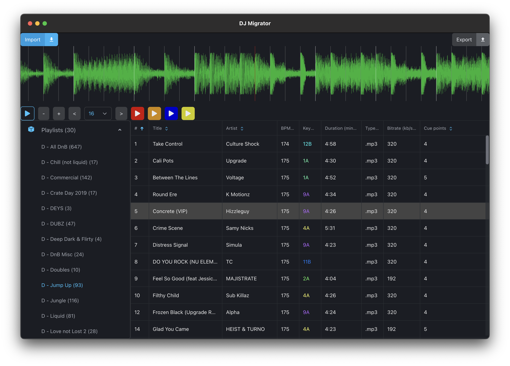

# DJ Migrator

  
  <em>The current WIP state of DJ Migrator</em>

**Roadmap:**

- [x] import Serato crates
- [x] decode Serato cue points
- [x] export to RekordBox collection XML
- [x] track table column sorting
- [x] display camelot key colours
- [x] decode audio file PCM values for waveform with FFmpeg
- [x] ~~create 2D canvas waveform display~~ (too slow)
- [x] create WebGL waveform display
- [x] show playhead
- [x] show cue points
- [x] show beat grid
- [x] beat jump
- [x] add track minimap
- [ ] edit/create cue points
- [ ] playlist organisation
- [ ] decode Serato beat grid
- [ ] latency compensation
- [ ] frequency colour-coded waveform
- [ ] handle MP3 VBR encodings (this could be solved be loading the entire track to a buffer. Need to investigate)
- [ ] Render WebGL waveform in a Worker using an OffscreenCanvas

## Motivation

I made a simple Serato to RekordBox playlist & cue point converter a few years ago before starting this project but quickly abandoned it once I converted all of my tracks and playlists over as I didn't need it anymore. I thought about adding more functionality other than just a simple converter but decided not to as RekordBox removed the ability to import and export collection XML files when they released RekordBox 6. I found out that they added the feature back in a later minor release so I'm making a start on the project again after three years. The goal is to make a fully fledge playlist and track manager where you can create playlists, add cues, edit metadata and export it to any DJ software.

This app is built on the Electron platform, uses the FFMpeg WASM binary to extract the PCM values from an audio file, and WebGL to create the waveform from those values.

I experimented using the standard 2D canvas API, but this was insanely slow to paint the waveform (took up to 10 seconds) as it needs to paint millions of lines so was impractical for my needs. This lead me to experiment with WebGL to see if I could pawn off the painting to the GPU. This was a massive success as it could paint the same millions of lines in ~0.1 ms on my laptop, which means I am able to smoothly animate the waveform during playback.

I ended up on using the FFmpeg WASM binary for extracting the PCM (amplitude) values from audio files as there were a few implications when running trying to extract the values using the Web Audio API in the browser. Initially I was wanting to load an audio file, parse and extract the PCM values from the browser. This had a few issues. For one, Electron being Chromium means that it comes with all of the security features of modern browsers. This is great and important for websites, but this can be a pain when you're building a "native" (heavy use of quotes here) application. The first issue I ran into was when I was trying to load an audio file from the file system into an `<audio>` element. File system access is not allowed. I got around this by creating a custom "local://" file system protocol using Electron's `protocol.registerFileProtocol`. This allowed me to access the local file system if the file paths were prepended with "local://" (e.g. `<audio src="local:///Users/user/example.wav">`). Sweet! I can now play audio files from the computer. But then I tried to get the PCM values out of it, which you can do using `AudioContext`'s `decodeAudioData` function. This was another blocker as for this to work you need an `ArrayBuffer` containing the binary data of the audio file itself, which can be only be done through either a network request, or reading a file which the only way of doing that in the browser is through user input with the `<input type="file">` element. This was a no go as I need to get the audio data when a user selects a track in a playlist. I needed to find another way.

Okay so the browser runtime doesn't have access to the local file system (without disabling all browser security measures which I'm not going to do), but I also have the Node runtime which orchestrates the entire application. Sweet, I know Node has full file-system access, so now I just need to find the best way to do this. There are plenty of NPM modules for reading audio files but I've always wanted an opportunity to use WASM and I already know of the FFmpeg WASM port [thanks to Fireship](https://www.youtube.com/watch?v=-OTc0Ki7Sv0) so lets do it. After finding [official FFmpeg documentation on extracting PCM values from an audio file](https://trac.ffmpeg.org/wiki/Waveform) I went ahead with it using the [@ffmpeg/ffmpeg](https://github.com/ffmpegwasm/ffmpeg.wasm) package to extract the PCM values and send them to the browser through inter-process communication.
